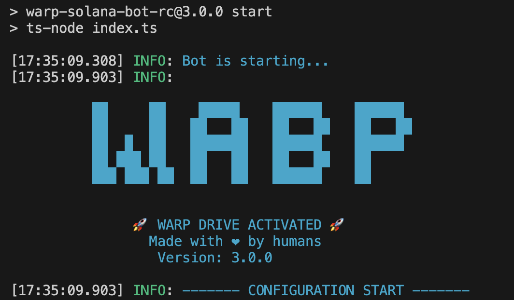
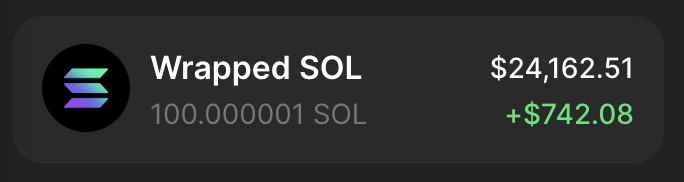

# Solana Trading Bot (RC)

The Solana Trading Bot is a software tool designed to automate the buying and selling of tokens on the Solana blockchain.
It is configured to execute trades based on predefined parameters and strategies set by the user.

The bot can monitor market conditions in real-time, such as pool burn, mint renounced and other factors, and it will execute trades when these conditions are fulfilled.

The current version has undergone multiple optimizations, including stability and processing speed improvements, making it better suited for the complexity of the current Solana market. Note: the previous @2.0.0 version repository is no longer maintained and has now continued here.

## 🎉 Incentive Campaign: Win SOL Rewards 🎉

To better promote and optimize our latest version, we are launching a limited-time incentive campaign! Users of this trading-bot-v3 can win up to 10 SOL in rewards by meeting the following conditions:

### How to participate:

1.	Use it continuously for 7 days with a total transaction volume xceeding $100,000.
2.	Refer at least 3 friends, and their total transaction volume exceeds $30,000.
> Note: We do not recommend opening multiple accounts to cheat in order to claim rewards.

### Exclusive benefits:

•	Using warp for trading? We’ll refund all your fees!
•	Your referred friends can also participate, the more you refer, the bigger the rewards!
> Note: This feature is disabled by default.

📅  Campaign ends on: January 1, 2025

💵  Once you’ve completed the conditions, please add my Discord to claim your reward: `warp_zona`

> Tip: The user with the highest monthly trading volume will have a chance to receive additional rewards!

## Setup

To run the script you need to:

- Convert some SOL to USDC or WSOL. (WSOL is more recommended. You can go to https://jup.ag/ and click “Manage” to wrap some SOL into WSOL)
  - You need USDC or WSOL depending on the configuration set below.
- Configure the script by updating `.env.example` file (remove the .example from the file name when done).
  - Check [Configuration](#configuration) section below
- To run this program, you must have a NodeJS environment. If you don’t have it, please go to https://nodejs.org/en to download and install it first.
- Install dependencies by typing: `npm install`
- Run the script by typing: `npm run start` in terminal

You should be able to see the following output along with many configurations you completed in the `.env` file:

### Configuration

#### Wallet

- `PRIVATE_KEY` - Your wallet's private key.

#### Connection

- `RPC_ENDPOINT` - HTTPS RPC endpoint for interacting with the Solana network.
- `RPC_WEBSOCKET_ENDPOINT` - WebSocket RPC endpoint for real-time updates from the Solana network.
- `COMMITMENT_LEVEL`- The commitment level of transactions (e.g., "finalized" for the highest level of security).

#### Bot

- `LOG_LEVEL` - Set logging level, e.g., `info`, `debug`, `trace`, etc.
- `ONE_TOKEN_AT_A_TIME` - Set to `true` to process buying one token at a time.
- `COMPUTE_UNIT_LIMIT` - Compute limit used to calculate fees.
- `COMPUTE_UNIT_PRICE` - Compute price used to calculate fees.
- `PRE_LOAD_EXISTING_MARKETS` - Bot will load all existing markets in memory on start.
  - This option should not be used with public RPC.
- `CACHE_NEW_MARKETS` - Set to `true` to cache new markets.
  - This option should not be used with public RPC.
- `TRANSACTION_EXECUTOR` - Set to `warp` to use warp infrastructure for executing transactions, or set it to jito to use JSON-RPC jito executer
  - For more details, check out [warp](#warp-transactions-rc) section
- `CUSTOM_FEE` - If using warp or jito executors this value will be used for transaction fees instead of `COMPUTE_UNIT_LIMIT` and `COMPUTE_UNIT_LIMIT`
  - Minimum value is 0.0001 SOL, but we recommend using 0.006 SOL or above
  - On top of this fee, minimal solana network fee will be applied

#### Buy

- `QUOTE_MINT` - Which pools to snipe, USDC or WSOL.
- `QUOTE_AMOUNT` - Amount used to buy each new token.
- `AUTO_BUY_DELAY` - Delay in milliseconds before buying a token.
- `MAX_BUY_RETRIES` - Maximum number of retries for buying a token.
- `BUY_SLIPPAGE` - Slippage %

#### Sell

- `AUTO_SELL` - Set to `true` to enable automatic selling of tokens.
  - If you want to manually sell bought tokens, disable this option.
- `MAX_SELL_RETRIES` - Maximum number of retries for selling a token.
- `AUTO_SELL_DELAY` - Delay in milliseconds before auto-selling a token.
- `PRICE_CHECK_INTERVAL` - Interval in milliseconds for checking the take profit and stop loss conditions.
  - Set to zero to disable take profit and stop loss.
- `PRICE_CHECK_DURATION` - Time in milliseconds to wait for stop loss/take profit conditions.
  - If you don't reach profit or loss bot will auto sell after this time.
  - Set to zero to disable take profit and stop loss.
- `TAKE_PROFIT` - Percentage profit at which to take profit.
  - Take profit is calculated based on quote mint.
- `STOP_LOSS` - Percentage loss at which to stop the loss.
  - Stop loss is calculated based on quote mint.
- `SELL_SLIPPAGE` - Slippage %.

#### Snipe list

- `USE_SNIPE_LIST` - Set to `true` to enable buying only tokens listed in `snipe-list.txt`.
  - Pool must not exist before the bot starts.
  - If token can be traded before bot starts nothing will happen. Bot will not buy the token.
- `SNIPE_LIST_REFRESH_INTERVAL` - Interval in milliseconds to refresh the snipe list.
  - You can update snipe list while bot is running. It will pickup the new changes each time it does refresh.

Note: When using snipe list filters below will be disabled.

#### Filters

- `FILTER_CHECK_INTERVAL` - Interval in milliseconds for checking if pool match the filters.
  - Set to zero to disable filters.
- `FILTER_CHECK_DURATION` - Time in milliseconds to wait for pool to match the filters.
  - If pool doesn't match the filter buy will not happen.
  - Set to zero to disable filters.
- `CONSECUTIVE_FILTER_MATCHES` - How many times in a row pool needs to match the filters.
  - This is useful because when pool is burned (and rugged), other filters may not report the same behavior. eg. pool size may still have old value
- `CHECK_IF_MUTABLE` - Set to `true` to buy tokens only if their metadata are not mutable.
- `CHECK_IF_SOCIALS` - Set to `true` to buy tokens only if they have at least 1 social.
- `CHECK_IF_MINT_IS_RENOUNCED` - Set to `true` to buy tokens only if their mint is renounced.
- `CHECK_IF_FREEZABLE` - Set to `true` to buy tokens only if they are not freezable.
- `CHECK_IF_BURNED` - Set to `true` to buy tokens only if their liquidity pool is burned.
- `MIN_POOL_SIZE` - Bot will buy only if the pool size is greater than or equal the specified amount.
  - Set `0` to disable.
- `MAX_POOL_SIZE` - Bot will buy only if the pool size is less than or equal the specified amount.
  - Set `0` to disable.

## Warp transactions (RC)

In case you experience a lot of failed transactions or transaction performance is too slow, you can try using `warp` for executing transactions.
Warp is hosted service that executes transactions using integrations with third party providers.

Note: Warp transactions are disabled by default.

### Security

When using warp, transaction is sent to the hosted service.
**Payload that is being sent will NOT contain your wallet private key**. Fee transaction is signed on your machine.
Each request is processed by hosted service and sent to third party provider.
**We don't store your transactions, nor we store your private key.**

Note: Warp transactions are disabled by default.

### Fees

When using warp for transactions, fee is distributed between developers of warp and third party providers.
In case TX fails, no fee will be taken from your account.

## Common issues

If you encounter an error that is not listed here, please contact me.
To collect more information on an issue, please change `LOG_LEVEL` to `debug`.

### Unsupported RPC node

- If you see following error in your log file:  
  `Error: 410 Gone:  {"jsonrpc":"2.0","error":{"code": 410, "message":"The RPC call or parameters have been disabled."}, "id": "986f3599-b2b7-47c4-b951-074c19842bad" }`  
  it means your RPC node doesn't support methods needed to execute script.
  - FIX: Change your RPC node. You can use Helius or Quicknode.

### No token account

- If you see following error in your log file:  
  `Error: No SOL token account found in wallet: `  
  it means that wallet you provided doesn't have USDC/WSOL token account.
  - FIX: Go to https://jup.ag/ and swap some SOL to USDC/WSOL. For example when you swap SOL to WSOL you should see it in wallet as shown below:

## Contact

- The current version has undergone multiple audits and testing, demonstrates strong profitability, and is free of errors. However, you should always pay attention to market changes and make adjustments accordingly. If you happen to encounter an overall market downturn while using it, I suggest waiting until the market stabilizes before running it again.

- If it helps you, please leave a star🌟. It will have a positive impact on future maintenance. If you want to leave a tip, you can send it to the following address:
  `7GtsKuSsM3hP3MGZoryvYqUGnsw7W4Lw3Pbui45mU65V`

- If you need custom features or assistance, feel free to contact the admin team on discord for dedicated support. Discord: `warp_zona` 

## Disclaimer

The Solana Trading Bot is provided as is, for learning purposes.
Trading cryptocurrencies and tokens involves risk, and past performance is not indicative of future results.
The use of this bot is at your own risk, and we are not responsible for any losses incurred while using the bot.
